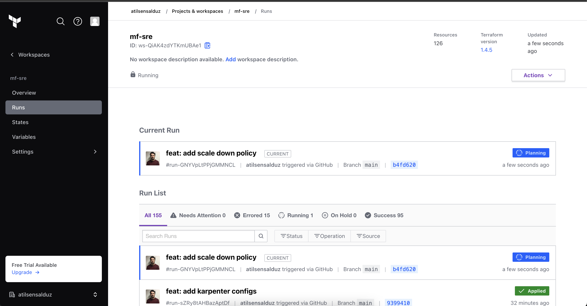
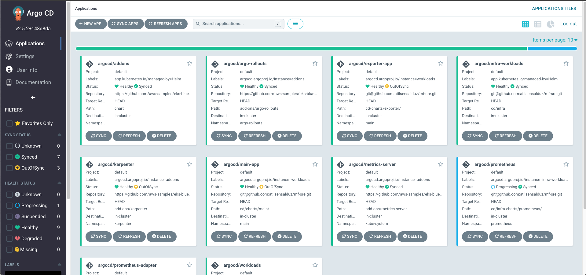
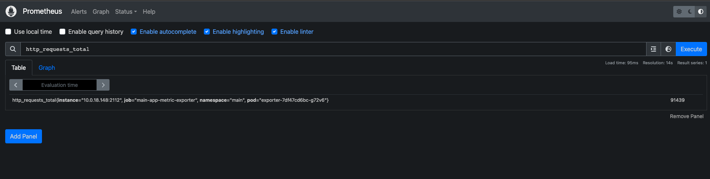
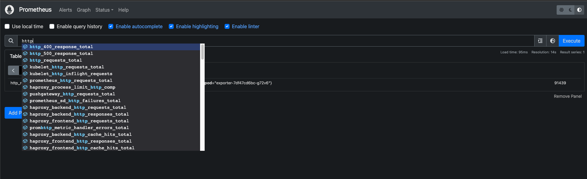
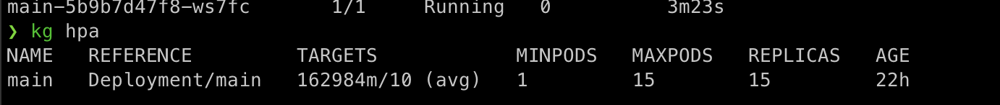
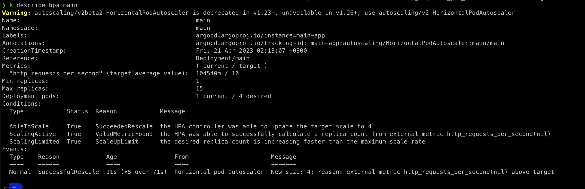
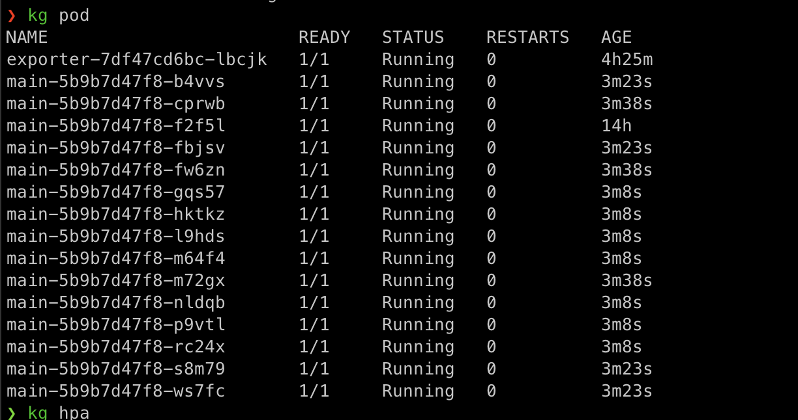
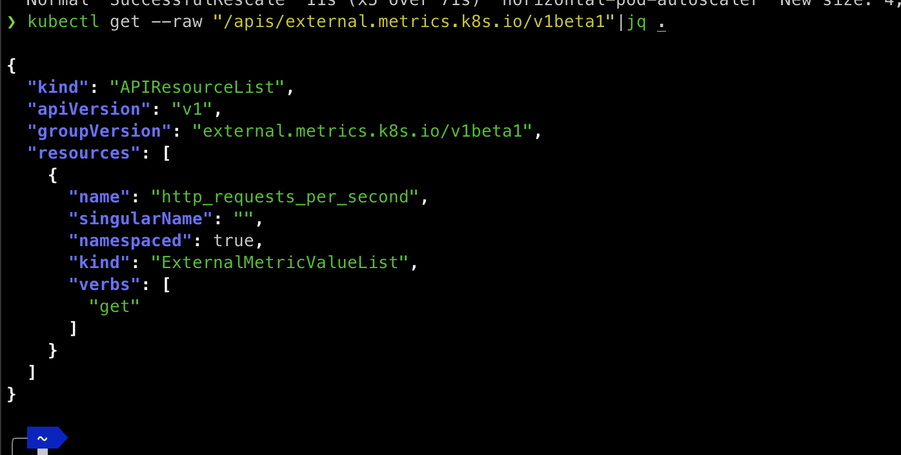

# MF-SRE project

This repository contains the explanation of MF-SRE repository. The repository involves deploying a Python service into a Kubernetes cluster on EKS, developing a Prometheus exporter to fetch metrics from the application, and using these metrics for HPA.

## Table of Contents

- [MF-SRE project](#mf-sre-project)
  - [Table of Contents](#table-of-contents)
  - [Prerequisites](#prerequisites)
  - [Deployment](#deployment)
    - ["infrastructure"](#infrastructure)
    - ["application"](#application)
  - [Prometheus Exporter](#prometheus-exporter)
  - [Horizontal Pod Autoscaler with External Metrics](#horizontal-pod-autoscaler-with-external-metrics)

## Prerequisites

Before deploying the application and infrastructure, you will need to have the following prerequisites:

- `Terraform`
  This project uses Terraform and Terraform Cloud to deploy infrastructure component. Before use it you need to create Terraform Cloud organization and connect github repository to Terraform Cloud 

  

- `Github` 
  This project uses Github Actions CI and ghcr.io to store applications' docker images. 

## Deployment

1. Infrastructure Deployment:

  This project is based on [**EKS Blueprints.com**](https://github.com/aws-ia/terraform-aws-eks-blueprints). EKS Blueprints contains a collection of Amazon EKS cluster patterns implemented in Terraform that demonstrate how fast and easy it is for customers to adopt Amazon EKS. 
  You can find the code related with infrastructure deployment in the ./infra directory
  ### "infrastructure"
  Infrastructure module needs the following variables to initialize all components to deploy and manage infrastructure. This module sets up the infrastructure for the Kubernetes cluster, including the VPC, subnets, security groups, IAM roles, and the EKS cluster itself. The module is defined in the ./modules directory.
  
  Variables
  *  name: The name of the infrastructure. In this case, it's set to "demo".
  *  vpc_cidr: The CIDR block for the VPC. In this case, it's set to "10.0.0.0/16".
  *  cluster_version: The version of Kubernetes to use for the EKS cluster. In this case, it's set to "1.25".
  *  instance_types: The instance types to use for the worker nodes in the EKS cluster. In this case, it's set to ["t3.medium"].
  *  capacity_type: The capacity type to use for the worker nodes in the EKS cluster. In this case, it's set to "SPOT".
  *  region: The AWS region to use for the infrastructure. In this case, it's set to "eu-west-1".
  *  argocd_repository_url: The URL of the Argo CD repository to use for deploying the application.

  With EKS Blueprints, we can deploy and manage Karpenter, Metrics Server, Argo Rollouts, and Argo CD. 
  Infrastructure module uses secret manager to store ArgoCD admin password. Code generates admin password via bcrypt_hash.
  Also it uses SSM parameter store to store ssh key pair which uses for accessing to repository.
    
  ### "application"

  This project uses ArgoCD for continues deployment. You can easily deploy and manage ArgoCD itself via EKS blueprints module. You don't need to any manual intervention to deploy and configure ArgoCD. It creates admin password as a secret in AWS Secret Manager. You can find ArgoCD admin's password in AWS Secret Manager name with argocd. And ArgoCD needs to connect to applications configuration repository so, it uses deploy secret. Infrastructure module also creates ssh key pair and stores it in SSM Parameter store.
  
  This project uses app of apps pattern to manage application. There are 3 different apps to manage other applications. You can find them in argocd_applications parameter. 
  * addons: to manage addons apps which are managed by EKS Blueprints
  * workloads: to manage our services. [main service and exporter service]
  * infra-workload: to manage infrastructure workload which are not managed by EKS Blueprints. [prometheus, prometheus-adapter]

2. CI & CD:
   This project uses Github Actions to manage Continues Integration. It basically builds docker images and pushes to ghcr.io. You need to make packages publicly accessible or keep private and add image pull secret to deployments. Also workflow updates automatically version of deployment in helm template. We can deploy our code without any intervention. 

   As I mentioned earlier the project uses ArgoCD to manage Continues Deployment. It uses Helm to manage configuration files. Our services related configurations are storing in ./cd/apps and ./cd/charts. ./cd/apps folder has configurations of ArgoCD application and ./cd/charts has Helm charts of deployment objects. Infra structure related configurations are storing  ./cd/infra and ./cd/infra-charts. ./cd/infra folder has infra structure components configurations of ArgoCD applications  and ./cd/infra-charts has their Helm charts.
  
  

## Prometheus Exporter

This application fetches metrics from different services and exposes them as Prometheus metrics. The application uses the `/metrics` endpoint to fetch the metrics data in JSON format. The application periodically fetches the metrics and updates the Prometheus metrics.



You can find detailed documentation in the following url:
[**exporter service**](https://github.com/atilsensalduz/mf-sre/tree/main/service/exporter)




## Horizontal Pod Autoscaler with External Metrics
This project uses prometheus-adapter to use external metrics by HPA. The Prometheus-Adapter rule is an essential component for extracting metrics from the http_requests_total metric produced by the main service. It is responsible for transforming the metric name and label, as well as computing the rate of change of the metric value. 








The Prometheus-Adapter rule used for extracting metrics is as follows:

```
rules:
  external:
  - seriesQuery: '{__name__="http_requests_total"}'
    resources:
      overrides: { namespace: {resource: "namespace"} }
    name:
      matches: "^(.*)_total"
      as: "${1}_per_second"
    metricsQuery: 'sum(rate(<<.Series>>{<<.LabelMatchers>>}[1m]))'
```

This rule has been configured to extract metrics from the `http_requests_total` metric produced by the Python service. The rule performs the following actions:

- `seriesQuery`: Defines the query used to filter the metric series. In this case, the query looks for all the series with the metric name `http_requests_total`.

- `resources`: Defines the Kubernetes resources to which the rule should be applied. In this case, the rule is applied to all namespaces.

- `name`: Defines the metric name and label transformations. In this case, the rule renames the metric from `http_requests_total` to `http_requests_per_second`.

- `metricsQuery`: Defines the query used to compute the metric value. In this case, the query computes the rate of change of the metric value over the last 1 minute.

